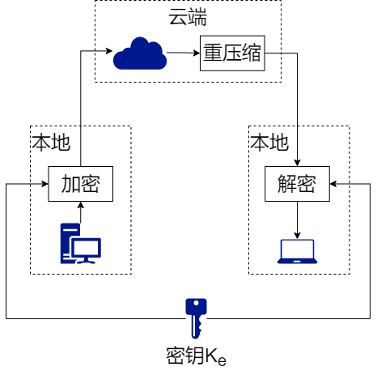
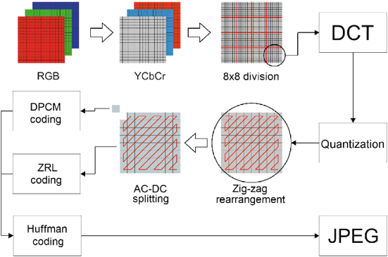
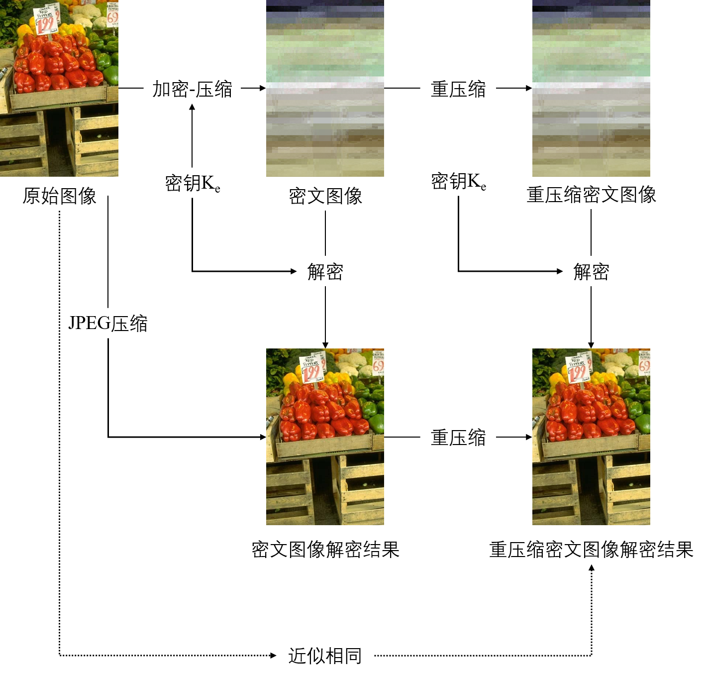

# JPEG-Compatible-Compression-and-Encryption

#### 一、项目描述
本项目基于论文[Recompression of JPEG Crypto-Compressed Images Without a Key](https://ieeexplore.ieee.org/document/8624571)，实现兼容JPEG图像格式的联合压缩-加密算法：可对JPEG图像进行联合压缩-加密，加密结果仍保持JPEG格式，支持重压缩且无需密钥参与。为网络环境受限条件下的数字图像安全云存储提供了一种解决方案。

#### 二、算法流程

##### 1.JPEG图像压缩算法

JPEG图像压缩算法流程如图下所示。依次进行：颜色空间转换、8x8分块、DCT变换、量化、Z字形重排列、熵编码。

##### 2.联合压缩-加密算法流程

本项目实现的联合压缩-加密算法流程如下图所示。在JPEG图像压缩算法流程中，直流、交流DCT系数分量被分别编码，每个系数由比特长度和振幅两部分表示。本项目对振幅部分通过流密码逐比特加密，即实现了保格式的数字图像加密。解密时只需将对应系数逐比特解密恢复，即可得到明文图像。

通过丢弃密文DCT系数的振幅部分的部分比特，并相应修改比特长度信息，即可实现密文图像的重压缩。该过程无需密钥参与。

#### 三、项目运行

##### 1.环境依赖

经测试的运行环境：python 3.8

依赖：pillow

##### 2.运行方法

运行encrypt.py文件，即可对样例图像进行加密，并解密密文图像，保存于img目录下。运行效果：

